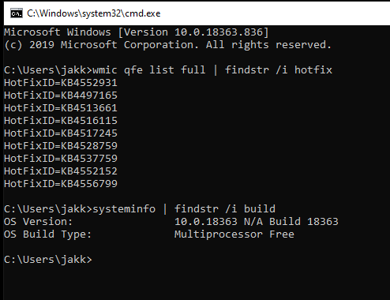
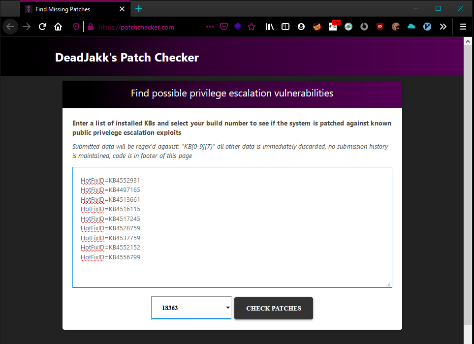

# Enter: [PatchChecker](https://patchchecker.com)
---

## TL;DR for people who got places to be:
I made a web service ([here](https://patchchecker.com/)) which is basically [Watson](https://github.com/rasta-mouse/Watson/) in how it makes it's comparison but it doesn't require you to maintain or run a binary locally on a system.
Instead you can just copy and paste your installed KBs into a text field on the site and select the build and find out if you're vulnerable to a CVE while providing links/resources if the system is in fact vulnerable. 
Also it has a curl "API" to get a JSON response from a terminal. No data is logged. It's also kept up to date automagically with a web scraper. Both the web application code and the data collector code is open-sourced. The data collector code can also be used to update Watson, if one felt so inclined. 


## The longer verison:  
During an engagement I was reading through the code prior to re-compiling [Watson](https://github.com/rasta-mouse/Watson/) and had the idea for PatchChecker. Before we get into it however, for those who do not already know: Watson is a is a C# binary written by [rastamouse](https://twitter.com/_rastamouse) that cross-references installed KB patches on a system with existing Microsoft patches that are known to fix commonly used privilege escalation exploits on Windows, it's really that simple, Watson enumerates all the KBs installed on the box from which it is run, looks at the build number of the system, and compares it with a (hard-coded) list of patches that your build number should have for each CVE, if there is a discrepancy, it informs you that the box it is running on is vulnerable. It's an awesome tool for sure, but there are a couple obstacles when using it in it's current form:  

- It's a binary   
- The CVEs and KBs are hard-coded and require a bit of manual work to add any additional CVEs  

Tackling the first bullet: it is a binary, and as is always the problem with binaries, you have to find a way to execute it and not get caught by the snitch-ware, and even if AV doesn't care, you may have to deal with application whitelisting which can turn into a rabbit whole all by itself depending on the implementation.
The second item: One may wish to add different CVEs or automatically update the patch information without manual work or compiling a binary. This may be why if you've been using an older version of Watson you may be getting incorrect information, this could be because you have superseded patches installed and Watson, not being aware of any patches since it's last update, doesn't know about them and gives you a false positive result because it doesn't see any of the patches that it knows to fix these vulnerabilities (because you're already "past" them).   
These caveats however, do not take away from the fact that what Watson does is very useful and can save you a lot of time and headache in determining what rabbit holes you spend your time in, and that alone makes a method like this great, but I wanted to see if I could make the process a bit more faster/scalable/practical.

## Patches & Vulns
I'm sure you have seen something like this: KB4556826.
I am also sure that you are already aware this is a number that corresponds to a patch released by Microsoft, but not just one patch or fix in particular, but a lot of them, all bundled together.
As time goes on and Microsoft keeps adding patches to prevent the work of the restless wicked, Microsoft will consolidate these patches over time and when that happens, a new number is created which implicitly includes the fixes to those previous vulnerabilities, at which point this new patch supercedes the old ones, thus removing the previous patch's KB number, out with the old end with the new... KB number as it were.
So for those of us looking to see if a given workstation is patched against a given privilege escalation exploit, we need to track what patch number this CVE was introduced in and continue to track all the new patches that come out which supercede the previous patch number until forever basically, Cool? not really, it's super annoying, tedious, and awful to do by hand. 

## Robots.
I didn't want to track this nonsense manually either, so I did what one does when feeling particularly lazy: I automated it with a web-scraper, nifty.
It's obviously open-sourced and being given away, see [here (github link)](https://github.com/deadjakk/patch-checker).
It's not super complicated, it uses [pyppeteer](https://github.com/pyppeteer/pyppeteer) to scrape a series of Microsoft pages, does some regex magic, scrapes some more and when it's finished, it outputs the data into your choice of a sqlite db or json output.
I'm not going to go into specifics here because this isn't an article about how to scrape websites and all of the tiny bits are included in the code in the the patchdata_collector.py file within the project.

## Pour it in the Flask
So at this stage we have the patch data in a database, now we just create a small web application to take the proper input and put it all together. 
To do this I threw together a flask application that takes a block of input, parses the KBs with regex, and pairs them with the provided build number to return the outstanding vulnerabilites given those parameters.
And at the end: you get a very convenient, web app that tells you what rabbit holes, if any, you should be diving down.

## Free stuff
So currently I am hosting an implementation of "PatchChecker" [here](https://patchchecker.com), anyone can use it, I'm not tracking anything, don't care about your data, I'm not asking you to follow me on twitter, join a discord, setup an account, sign in with google, or accept a cookie prompt to use it. But if you don't trust me then awesome, you can spin up your own service using the [source code](https://github.com/deadjakk/patch-checker). 
If you ARE interested in standing up your own, keep in mind you can add additional CVEs, and create your own web interface or whatever (see README on github). 
On that same note, keep in mind, your web page won't look as pretty as mine since I don't see the need to clutter the github with the extra assets and junk that are on my website,
I instead included a functional but ugly version of the web pages, though feel free to scrape my site if you feel like you need to add some color in that part of your life.
The CVEs I am currently tracking are in the cves.txt file of the github and also displayed in the output when you actually use the site if you want to add more just follow the convention you see in there and add whatever you like.  
Now speaking of actually using the site: I've included a couple shots using PatchChecker via a browser:

### Just one way to get the data you need:


### Expected input:


### Expected output from webpage:


### Expected output from webpage when vulnerabilities are found:


Alternatively, you can use a curl command, keep in mind you should be able to use almost any delimiter you wish as long as it doesn't break the regex, i'm using spaces here.
Request:   
```
curl 'https://patchchecker.com/checkprivs/' --data-raw 'wmicinfo=KB1231411 KB1231441 KB1234141&build_num=17763'
```
Response:   
note: used some fake KBs so it's showing vuln to everything, i.e. I have nothing installed, also this output is truncated for space
```
{
    "total_vuln": 9,
    "kbs_parsed": [
        "KB1231411",
        "KB1231441",
        "KB1234141"
    ],
    "total_kbs_parsed": 3,
    "build": "17763",
    "results": [
        {
            "refs": [
                "https://exploit-db.com/exploits/46718",
                "https://decoder.cloud/2019/04/29/combinig-luafv-postluafvpostreadwrite-race-condition-pe-with-diaghub-collector-exploit-from-standard-user-to-system/"
            ],
            "name": "CVE-2019-0836",
            "vulnerable": true
        }
		]
}

```
So there you have it, go nuts, just not like totally insane, or I'm gonna have to be lame and captcha it, which is probably going to break the curl forever because this isn't serious enough to set up accounts and API keys or whatever. On the other hand, if nobody uses it then no need to pay for it, I'll take it down, and you'll still have the code. 

Have fun, hope you get NT\SYSTEM,
